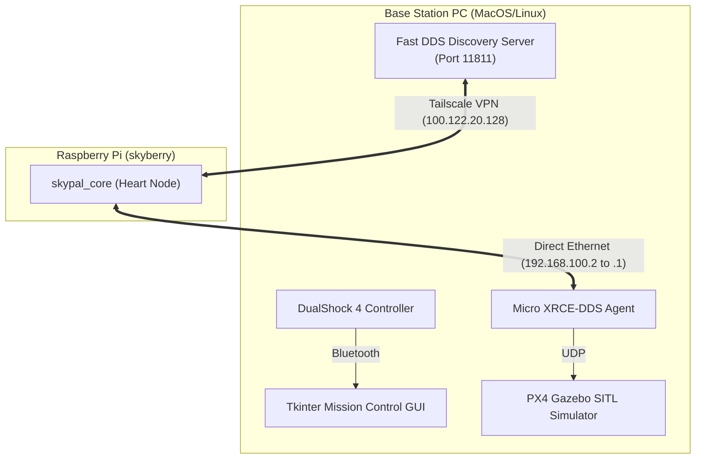

# Skypal Hardware-in-the-Loop Architecture Report

## 1. Project Overview & Accomplishments
We have successfully engineered and launched a complex **Hardware-in-the-Loop (HITL) Simulation Architecture** that integrates a physics-accurate UAV simulation (PX4 in Gazebo) with distributed physical hardware (Raspberry Pi) and a centralized Mission Control PC.

Our primary achievements include:
1. **Custom VPN & RJ45 Routing Configuration**: We successfully designed an architecture where a remote Raspberry Pi (`skyberry`) controls the desktop's high-fidelity simulation. To do this, we routed all high-level control and teleoperation data over a Tailscale VPN (emulating real-world RC/LTE latency). Conversely, we locked the ultra-high-frequency PX4 internal comms to a direct RJ45 Ethernet link. This prevents the fragile PX4 timestamp synchronization from crashing due to VPN lag.
2. **Robust Failsafe Heartbeat System**: We built a `skypal_core` node physically running on the Raspberry Pi. This node continually monitors the latency of the VPN connection. If communication to the PC controller breaks for more than 500ms, the Pi immediately overrides user input, commands zero-velocity Setpoints to the autopilot, and forces the Gazebo drone to freeze and hover safely.
3. **DualShock 4 Teleoperation & Data Collection**: We fully mapped a DualShock 4 controller into a standard RC "Mode 2" layout, successfully bridging physical joystick inputs across the VPN to drive the simulated drone's velocity.
4. **Mission Control Multiplexer GUI**: We developed a monolithic desktop application leveraging Python's Tkinter to abstract the complexities of starting six distributed processes. The GUI handles automated boot sequences, dynamically configures IPs/ports, and injects parameters like the target Gazebo simulation world directly into the launch sequence.

---

## 2. Explicit Rationales for the Setup

### Why the DualShock Controller?
The decision to tightly integrate the DualShock 4 controller was strategic, serving three distinct and critical purposes:
1. **Manual Flight Validation**: To manually verify that our VPN architecture, latency monitoring, and `px4_msgs` coordinate transformations were working correctly before relinquishing control to autonomous code.
2. **Proving the VPN Tunneling Capability**: By routing 50Hz continuous joystick inputs and heartbeat timestamps across the Tailscale VPN, we proved our custom Fast DDS Discovery Server can handle the bandwidth and routing necessary to beam teleoperation data anywhere in the world.
3. **Data Collection for AI Training (MobileNetV2)**: The most crucial reason. Before we can train an autonomous computer vision model (MobileNetV2), we need thousands of labeled images. By using the DualShock to manually steer the drone around the simulated Gazebo worlds, we can write a simple script to capture camera images correlated with the drone's position, effectively generating our own massive training dataset for the neural network. 

---

## 3. Architecture Diagrams

### A. Network & Hardware Topology
This diagram illustrates the physical and virtual networking layers established between the PC and the Raspberry Pi.

### B. ROS 2 Control Flow & Topic Routing
This diagram traces the flow of data from the user's thumbs, across the VPN, into the PI, and finally down to the Gazebo drone.

```mermaid
sequenceDiagram
    participant Joy as Joy Node (PC)
    participant Ctrl as Controller Node (PC)
    participant VPN as VPN (Tailscale)
    participant Core as Heart Node (Pi)
    participant RJ45 as Ethernet (RJ45)
    participant PX4 as PX4 Flight Controller
    
    Joy->>Ctrl: /joy (Buttons & Axes)
    
    rect rgb(40, 40, 40)
        Note over Ctrl, Core: Fast DDS over VPN
        Ctrl->>VPN: /skypal/cmd_vel (Twist)
        Ctrl->>VPN: /skypal/heartbeat (50Hz)
        VPN->>Core: Forwarded to Pi
    end
    
    Note over Core: 1. Monitor Latency<br>2. Rotate Body Velocities to NED
    
    rect rgb(60, 40, 40)
        Note over Core, PX4: Micro XRCE-DDS Agent over RJ45
        Core->>RJ45: /fmu/in/trajectory_setpoint
        Core->>RJ45: /fmu/in/offboard_control_mode
        RJ45->>PX4: Forwarded to Simulator
    end
    
    PX4-->>Core: /fmu/out/vehicle_status (Armed State)
```

---

## 4. Hurdles Overcome
During development, we conquered several major technical roadblocks:
1. **DDS Discovery Isolation**: Initially, the ROS 2 nodes on the PC and Pi could not "see" each other over the Tailscale interface. We solved this by launching a dedicated `fastdds` Discovery Server on the PC, explicitly binding the ROS environments to the VPN IP (`100.122.20.128:11811`), and overriding the default multicast behavior.
2. **PX4 Offboard Mode Rejection**: Even when the systems successfully communicated, PX4 refused to enter Offboard Mode. We determined that PX4 requires an active stream of `OffboardControlMode` messages *before* the mode switch is requested. Furthermore, PX4 rejected our velocity commands because unused setpoint fields (like acceleration, jerk, and yaw target) defaulted to `0.0` instead of `NaN` (Not a Number). Modifying the Python setpoint publisher solved this.
3. **Coordinate Frame Twist (NED vs Body)**: When pushing the joystick forward, the drone moved sideways. We identified a physics mismatch: PX4 expects Earth-Fixed (NED) velocities, but our joystick generated Body-Fixed inputs. We solved this by updating `skypal_core` to subscribe to the drone's IMU Quaternions, calculating its live Yaw, and dynamically rotating the joystick commands to align with the drone's true heading.

---

## 5. Roadmap: Autonomous Deployment (MobileNetV2)
With the VPN tunneling and manual data collection architecture validated, the next step is transitioning from teleoperation to computer vision autonomy. 

**Objective**: Deploy MobileNetV2 on the Raspberry Pi to process live video and autonomously drive the drone without the DualShock.

### Evaluation of the MobileNetV2 Approach
Using MobileNetV2 is an excellent, conceptually sound strategy. 
* **Pros**: It is specifically architected for edge devices (utilizing depth-wise separable convolutions), drastically reducing the parameter count to run inference directly on a Raspberry Pi without a heavy GPU. Furthermore, its minimal latency is critical for high-speed drone operations.
* **Risks & Mitigation**: Running raw TensorFlow alongside the ROS 2 DDS Server and the Skypal Core flight node will thermally bottleneck the Pi's CPU. **Recommendation:** Convert the trained MobileNetV2 model into **TensorFlow Lite (TFLite)**. TFLite is infinitely more efficient on ARM processors and will yield the frame rates required for real-time flight control.

### Execution Steps
1. **Simulated Camera Setup**: Add a downward or forward-facing camera plugin to the `x500` SDF model in Gazebo, bridging the video to a `sensor_msgs/Image` ROS 2 topic.
2. **Dataset Generation (DualShock)**: Write a data collection node on the Pi. While manually flying the drone via the DualShock controller in Gazebo, press a button to save images correlated with the target's location to a local directory.
3. **Data Augmentation**: Apply heavy data augmentation (blur, noise, varying lighting) to the perfect Gazebo images so the model doesn't overfit to the simulation's unrealistic lighting.
4. **Train & Convert**: Train MobileNetV2 on the PC with this dataset, export it to `.tflite`, and transfer it to the Pi.
5. **Autonomy Node**: Develop a new ROS 2 node that runs the TFLite inference in real-time, replacing the `controller_node` by publishing autonomous steering commands directly to the `/skypal/cmd_vel` topic based on the bounding boxes detected by the camera.
